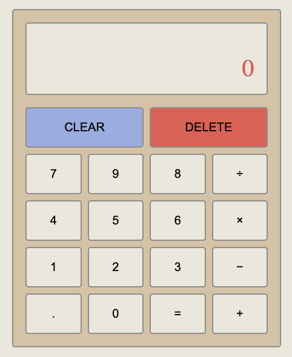

# Calculator

## [Live Demo](https://cwarcup.github.io/Calculator/) :point_left:

# Funcitons

- Can perform basic calculations such as multiplication, division, addition and subtraction.
- Clear button will remove previous equation and answers.
- Delete button will remove the most recent input (number and decimal points).
- Added ability to only add one decimal.
- Hidden message will be displayed when attempting to divide by zero.
- Input two operands and the desired operator to be executed by clicking the equal button.

# Possible Updates

- String to gether several operations.
- keyboard support.
- 'Backspace' button to undo previous action.
- +/- key added.
- Exponent buton.

# Calculator Preview

